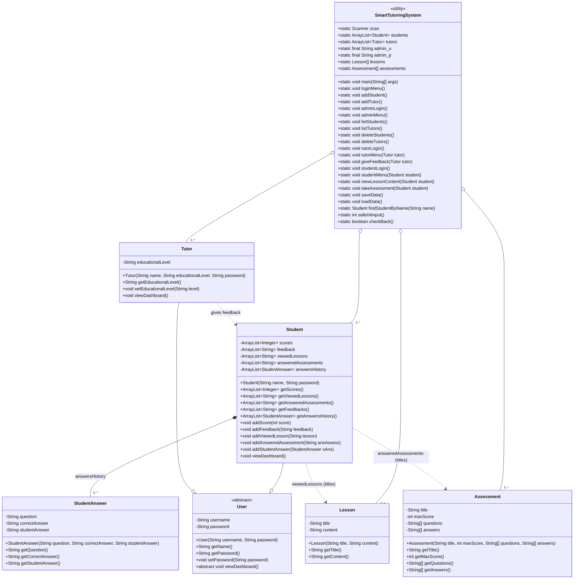

# Smart Learning Assistant (SLA) - UML Class Diagram

```mermaid
classDiagram
  direction TB

  class SmartTutoringSystem {
    <<utility>>
    +static Scanner scan
    +static ArrayList~Student~ students
    +static ArrayList~Tutor~ tutors
    +static final String admin_u
    +static final String admin_p
    +static Lesson[] lessons
    +static Assessment[] assessments

    +static void main(String[] args)
    +static void loginMenu()
    +static void addStudent()
    +static void addTutor()
    +static void adminLogin()
    +static void adminMenu()
    +static void listStudents()
    +static void listTutors()
    +static void deleteStudents()
    +static void deleteTutors()
    +static void tutorLogin()
    +static void tutorMenu(Tutor tutor)
    +static void giveFeedback(Tutor tutor)
    +static void studentLogin()
    +static void studentMenu(Student student)
    +static void viewLessonContent(Student student)
    +static void takeAssessment(Student student)
    +static void saveData()
    +static void loadData()
    +static Student findStudentByName(String name)
    +static int safeIntInput()
    +static boolean checkBack()
  }

  class User {
    <<abstract>>
    -String username
    -String password
    +User(String username, String password)
    +String getName()
    +String getPassword()
    +void setPassword(String password)
    +abstract void viewDashboard()
  }

  class Student {
    -ArrayList~Integer~ scores
    -ArrayList~String~ feedback
    -ArrayList~String~ viewedLessons
    -ArrayList~String~ answeredAssessments
    -ArrayList~StudentAnswer~ answersHistory

    +Student(String name, String password)
    +ArrayList~Integer~ getScores()
    +ArrayList~String~ getViewedLessons()
    +ArrayList~String~ getAnsweredAssessments()
    +ArrayList~String~ getFeedbacks()
    +ArrayList~StudentAnswer~ getAnswersHistory()
    +void addScore(int score)
    +void addFeedback(String feedback)
    +void addViewedLesson(String lesson)
    +void addAnsweredAssessment(String ansAssess)
    +void addStudentAnswer(StudentAnswer sAns)
    +void viewDashboard()
  }

  class Tutor {
    -String educationalLevel
    +Tutor(String name, String educationalLevel, String password)
    +String getEducationalLevel()
    +void setEducationalLevel(String level)
    +void viewDashboard()
  }

  class Lesson {
    -String title
    -String content
    +Lesson(String title, String content)
    +String getTitle()
    +String getContent()
  }

  class Assessment {
    -String title
    -int maxScore
    -String[] questions
    -String[] answers
    +Assessment(String title, int maxScore, String[] questions, String[] answers)
    +String getTitle()
    +int getMaxScore()
    +String[] getQuestions()
    +String[] getAnswers()
  }

  class StudentAnswer {
    -String question
    -String correctAnswer
    -String studentAnswer
    +StudentAnswer(String question, String correctAnswer, String studentAnswer)
    +String getQuestion()
    +String getCorrectAnswer()
    +String getStudentAnswer()
  }

  %% Inheritance
  Student --|> User
  Tutor --|> User

  %% Aggregations/Compositions and associations
  SmartTutoringSystem o-- "0..*" Student
  SmartTutoringSystem o-- "0..*" Tutor
  SmartTutoringSystem o-- "0..*" Lesson
  SmartTutoringSystem o-- "0..*" Assessment

  Student *-- "0..*" StudentAnswer : answersHistory
  Student ..> Lesson : viewedLessons (titles)
  Student ..> Assessment : answeredAssessments (titles)
  Tutor ..> Student : gives feedback
```
